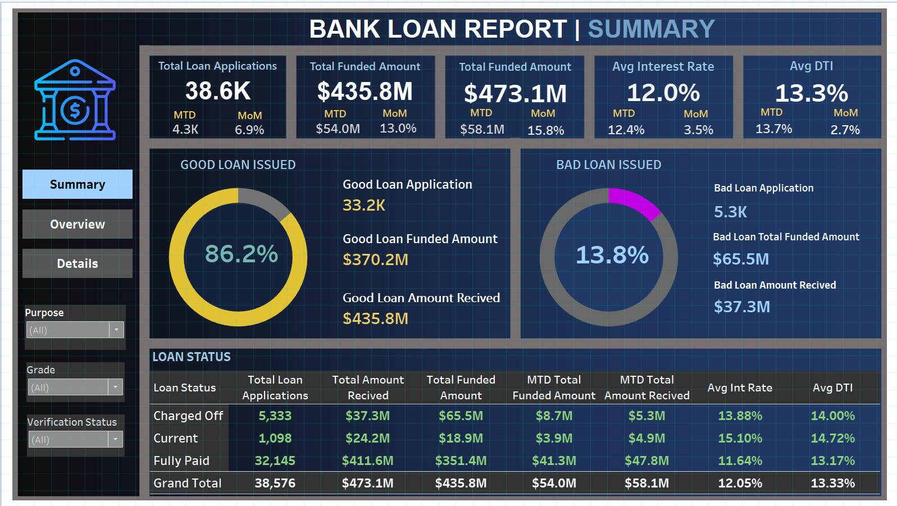
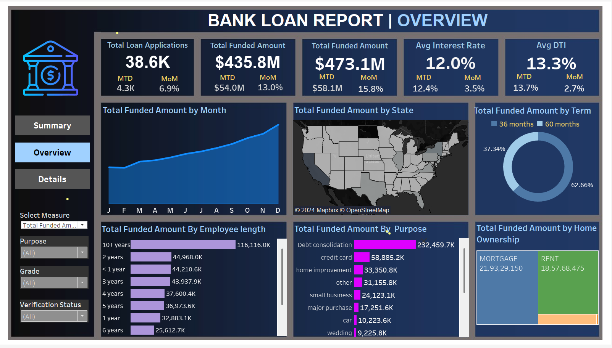
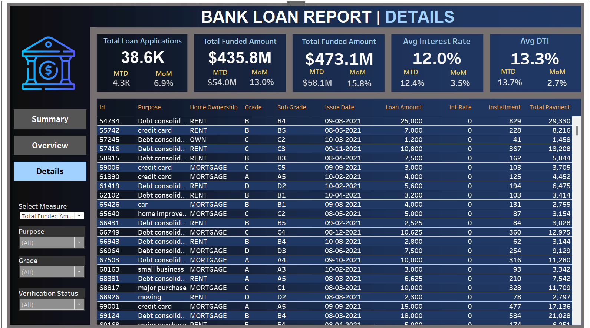

# Bank Loan Analysis Dashboard 🚀

This project is part of my capstone coursework, where I applied skills learned during my academic journey, including SQL and Tableau. It demonstrates my ability to analyze and visualize data through interactive dashboards tailored for strategic decision-making.

## Dashboard Overview 📊

The project consists of three primary dashboards: **Summary**, **Overview**, and **Detail**, each designed with custom self-created backgrounds for a seamless and professional aesthetic. These dashboards enable data-driven decision-making through clear, interactive visuals and comprehensive insights.

**Dataset:**  
The dataset used in this project contains loan-related data, including borrower details, loan amounts, repayment history, and loan statuses. This dataset is the foundation for calculating key performance indicators (KPIs) and generating visuals.  
[view the Dataset](financial_loan.csv) 📂

**Query Document:**  
A meticulously crafted **Query Document** is attached, which:  
- **Documents All Queries**: Outlines each query used for metrics and visuals in detail.  
- **Ensures Accuracy**: Demonstrates how values are calculated and validated.  
- **Supports Traceability**: Ensures that every data point in the dashboards is reliable and transparent.  
[view the Query Document](queries/loan_queries.sql) 📄

---

## Dashboard Background 🎨

The background for all three dashboards (Summary, Overview, and Detail) was designed in PowerPoint. The custom background enhances the visual appeal of each dashboard, providing a professional and cohesive look that aligns with the overall design.

### Summary Dashboard  
 🏦

### Overview Dashboard  
 📈

### Detail Dashboard  
 💡

---
## Tableau Dashboard Link
You can view the dashboard by clicking on the following link:
[View Tableau Dashboard](https://public.tableau.com/authoring/Book1_17329707973630/SUMMARY#1)

### 1. Summary Dashboard 📊

**Background and Purpose:**  
The **Summary Dashboard** is designed to provide an overview of our bank's lending activities. Its clean and structured layout focuses on delivering critical metrics like total loans, funded amounts, and repayments, alongside the categorization of loans into 'Good Loans' and 'Bad Loans.'

**Problem Statement:**  
The report provides insights into key loan-related metrics and trends over time, enabling effective monitoring of the bank's lending portfolio and data-driven strategic planning.

**Key Features:**  
- **Loan Applications**: Total number and trends (Month-to-Date and Month-over-Month).  
- **Funded Amounts**: Total and trends.  
- **Amount Received**: Total repayment tracking.  
- **Average Interest Rates**: Variations in lending cost.  
- **Good Loans vs. Bad Loans KPIs**: Breakdown based on loan statuses.

**Background Design:**  
The **Summary Dashboard** background employs a structured grid layout with a balanced color palette to enhance data readability and focus on KPIs.

 📊

---

### 2. Overview Dashboard 🌍

**Background and Purpose:**  
The **Overview Dashboard** provides a high-level analysis of critical metrics and trends using various chart types. Designed for dynamic insights, it helps in understanding regional trends, borrower behaviors, and loan purposes.

**Problem Statement:**  
This dashboard visually represents trends in loan statuses, borrower distributions, and lending KPIs.

**Key Features:**  
1. **Monthly Trends by Issue Date** (Line Chart): Highlights how applications, funding, and repayments evolve over time.  
2. **Regional Analysis by State** (Filled Map): Shows state-wise activity and disparities.  
3. **Loan Term Analysis** (Donut Chart): Depicts term-based loan distribution.  
4. **Employee Length Analysis** (Bar Chart): Examines trends based on employment history.  
5. **Loan Purpose Breakdown** (Bar Chart): Analyzes loans by stated purposes.  
6. **Home Ownership Analysis** (Tree Map): Explores metrics by home ownership categories.

**Background Design:**  
The **Overview Dashboard** background integrates regional maps and thematic icons to provide visual context, enhancing user engagement and understanding.

 🌐

---

### 3. Detail Dashboard 🔍

**Background and Purpose:**  
The **Detail Dashboard** consolidates all critical metrics into a single view. It provides an interactive and in-depth exploration of loan data, including borrower demographics and repayment trends.

**Problem Statement:**  
This dashboard offers users a comprehensive and user-friendly interface for analyzing detailed loan portfolio performance and borrower-specific insights.

**Key Features:**  
- Detailed metrics for loan statuses, borrower profiles, and repayment patterns.  
- Interactive filters for customized views.

**Background Design:**  
The **Detail Dashboard** background features subtle textures and data-grouping frameworks, promoting ease of navigation and clarity for granular details.

 📋

---

### Data Accuracy and Validation ✅

To ensure the reliability of insights:  
- **Query Document**: The attached Query Document outlines every query used in the dashboards, demonstrating accuracy and traceability.  
- **Validation**: All metrics and calculations have been cross-checked for consistency, ensuring reliable data for decision-making.  
- **Dataset Integrity**: The dataset was cleaned and verified to ensure completeness and correctness before analysis.

These steps ensure the dashboards provide accurate, actionable, and trustworthy insights into loan performance and trends.  
## License 📝
This project is licensed under the  Apache License – see the [LICENSE](LICENSE) file for details.

## Acknowledgements 🌟
- Special thanks to [Data Source](kaggle.com/datasets) for providing the loan dataset.
- Inspiration for this project came from [Tableau Training Resources](https://www.tableau.com/learn/training).

## Contact 📬
- Email: ashwinkumarayyappan@gmail.com
- LinkedIn: [Ashwin kumar A](https://www.linkedin.com/in/ashwin-kumar-a-848650290/overlay/about-this-profile/)
